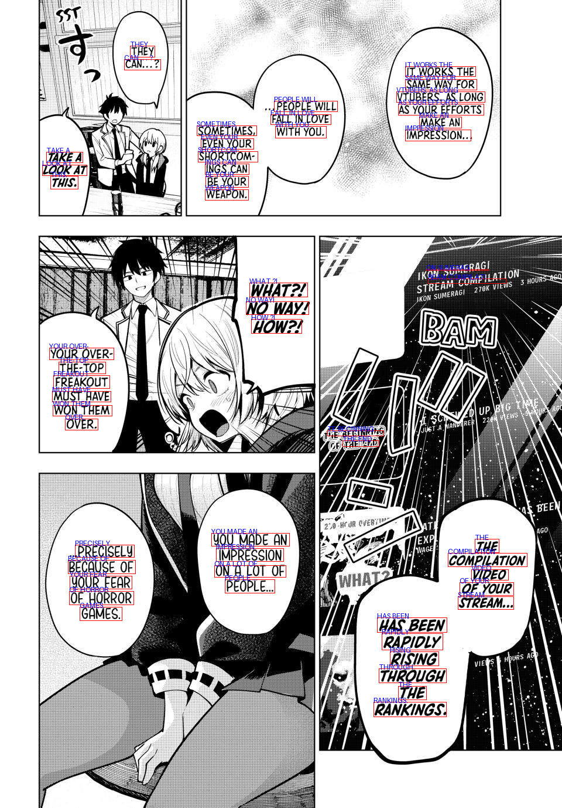

# Comic Scans

A project to index a manga and make the entirety of its text searchable.




This project is powered by [cubari.moe](https://cubari.moe) for the images.
The OCR modes can be chosen between [Surya OCR](https://github.com/VikParuchuri/surya)/[EasyOCR](https://github.com/JaidedAI/EasyOCR) (default: surya)
(Will be adding more options in the future)

Included an example response to help gauge understanding on how it's to be used

## Usage

You can run
```
python comic_ocr.py -i <manga-link>
```

Or you can skip the parameter and it'll ask you automatically

## License

This project is licensed under MIT

Note: Not affiliated with Comic Sans MS